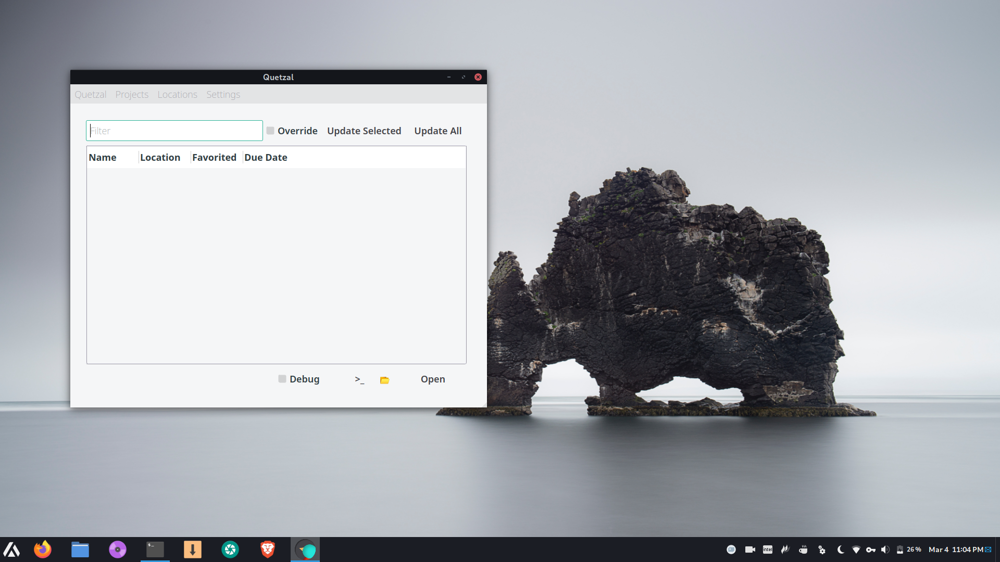
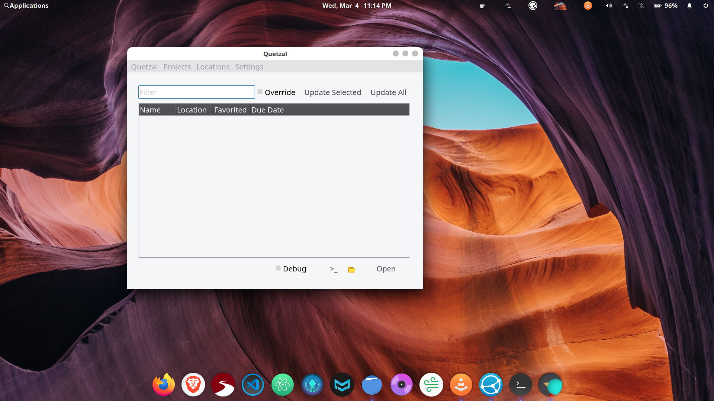

# Quetzal v0.1.1 - Wix Local Projects Manager

**Quetzal** is a GUI frontend for managing your Wix Local Editor projects made with PyQt5.

 

This app is in alpha, so it requires some work to run. However, it's come far enough along that **v0.2** will probably come packaged as an executable for Windows, Mac, and Linux. That being said, it depends on the Corvid Local Editor, which is also in alpha.

 

***Please submit issues, and specify your OS***

## Installation/Usage

**Install:**

GitClone this repository and run using **python3.5** or newer.

**Install Dependencies:**

`python3.8 -m pip install PyQt5 pyqtspinner`
or
`pip install PyQt5 pyqtspinner`
 

`npm i -g corvid-cli --save-dev corvid-types`

**Run:**

Travel to the project directory and run:

`python3.8 .`

or

`python3.8 __main__.py`

 

## FAQ

Why not **python3**?

Because it's 2020 and the app will be compiled into an executable anyway.

 

Why doesn't **{insert here}** work?

It's an alpha, so please submit detailed issue reports so that stuff can be fixed, including the name of your operating system.

 

What's known not to work?

**Crucial/priority:**

- Updating projects - ~~The scripts to update projects work, but lack of proper threading causes the app to freeze.~~ *No longer freezes, but still glitchy.*

- Refresh on start - This option in settings currently does nothing, since updating doesn't work properly.

- Watched projects - Broken functionality for now, since a file watching worker is in the works.

- ~~Setting project deadlines - This should be working again very soon.~~ *Fixed*

- ~~Window resizing/repainting.~~ *Fixed*

- ~~Better column sizing for the projects tree on appstart.~~ *Fixed*

**Other:**

- ~~The app font and color settings are not functional yet, but will be very soon~~ *Now functional - requires restart*

- The icon - Yes, it's ugly even for a placeholder. That will change eventually.
  
 

## What's on the docket?

- A nice splash screen and/or dialog for installing the local editor without using the command line.

- The ability to revert a snapshot for a given project.

- Adding ~~tooltips and~~ a help dialog.

- An applet/dock indicator.

- An executable and probably a Windows installer.

 

## License

**MIT**